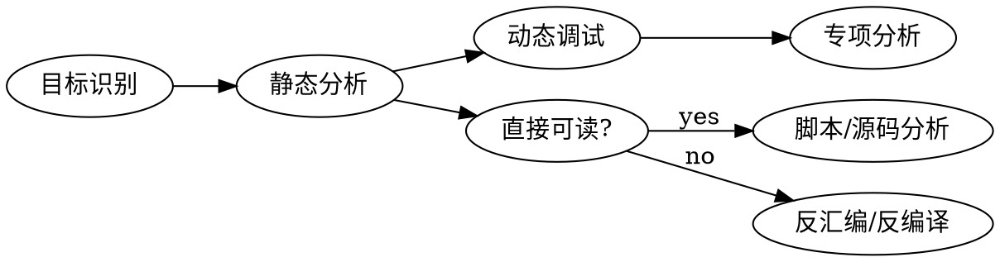
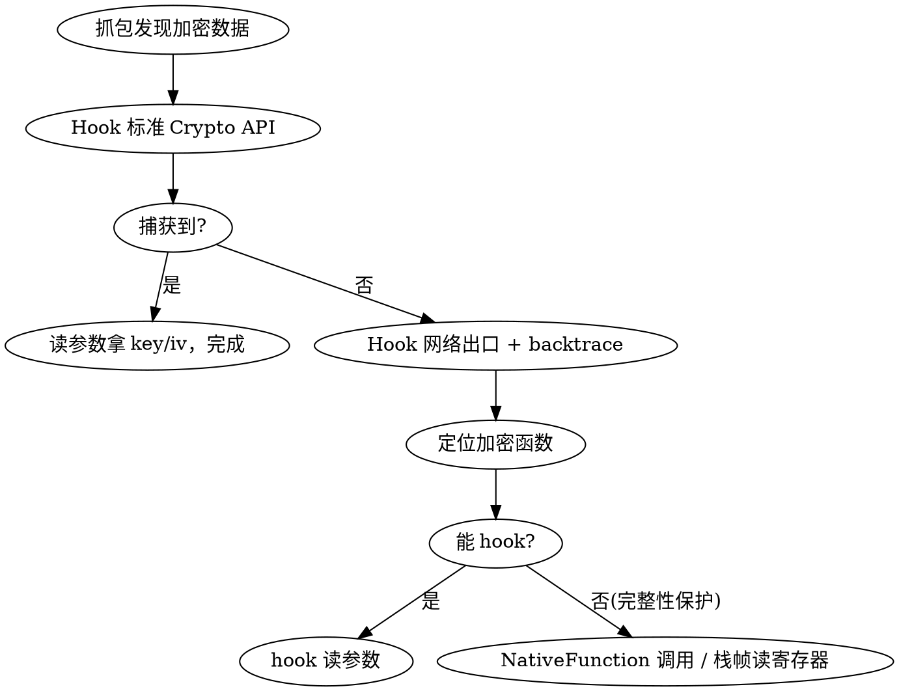
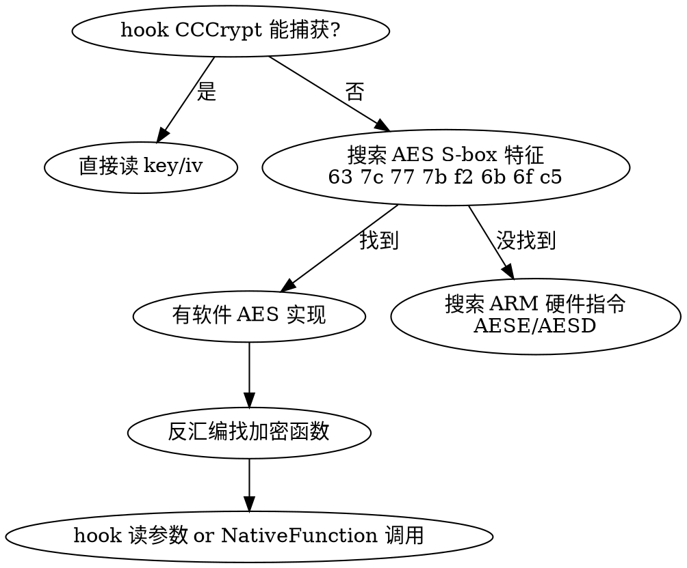

# Reverse Engineering

## Overview

系统性地分解未知目标（二进制、固件、协议）以理解其内部逻辑。核心原则：**先广后深**——快速建立全局认知，再针对性深入关键区域。

## 分析流程



**第一步：目标识别（2分钟）**

```bash
file target           # 文件类型
strings target | grep -E "(http|flag|key|pass|version)"
binwalk target        # 嵌入文件/固件结构
checksec target       # 保护机制 (PIE/ASLR/NX/Canary)
```

## 静态分析

### 工具选择

| 场景 | 工具 | 命令/用法 |
|------|------|-----------|
| 反汇编/反编译 | Ghidra (免费) | 打开项目 → Auto-analyze → Decompiler 窗口 |
| 商业逆向 | IDA Pro | F5 反编译，Shift+F12 字符串，X 交叉引用 |
| 轻量分析 | Binary Ninja | 内置 MLIL/HLIL 多层IR |
| CLI 快速 | objdump/readelf | `objdump -d -M intel binary` |
| 符号恢复 | pwndbg + pwntools | ASLR 泄漏 + ROP 链构造 |

### 关键分析点

```
入口点 → main() → 关键功能函数
交叉引用 (xref) → 谁调用了敏感函数？
字符串 → 硬编码凭据/错误消息/格式化字符串
导入表 → 使用了哪些危险 API？(strcpy/system/exec)
```

### Ghidra 快速工作流

```
1. File > New Project > Import File > Run Analysis
2. Window > Decompiler (F3 跳转到定义)
3. 右键函数名 > References > Find All References
4. Edit > Find/Query > Search Memory (搜索字节序列)
5. 重命名变量: L 键; 重命名函数: 右键 > Rename Function
```

## 动态调试

### GDB/pwndbg 常用命令

```bash
# 启动
gdb ./binary
gdb --args ./binary arg1 arg2

# 断点
b main          # 函数断点
b *0x401234     # 地址断点
b func if $rdi==0  # 条件断点

# 执行控制
r               # run
ni / si         # next/step instruction
c               # continue
fin             # 执行到函数返回

# 内存检查 (pwndbg)
x/20gx $rsp     # 查看栈
x/s 0x402010    # 查看字符串
vmmap           # 内存映射
telescope $rsp  # 栈可视化
```

### Frida 动态插桩（黑盒分析）

```python
import frida

# Hook 函数调用
script = """
Interceptor.attach(Module.findExportByName(null, "strcmp"), {
    onEnter: function(args) {
        console.log("strcmp:", args[0].readUtf8String(), args[1].readUtf8String());
    }
});
"""
session = frida.attach("target_process")
session.create_script(script).load()
```

## iOS App 逆向

### Frida 反检测绕过

**检测方式 → 绕过方案速查表**:

| 检测层 | 原理 | 特征 | 绕过 |
|--------|------|------|------|
| SVC 系统调用 | 二进制中嵌入 `svc #0x80` 直接调内核 | 毫秒级闪退 | 扫描可执行内存，`01 10 00 D4` 全替换 NOP |
| dyld 库枚举 | `_dyld_image_count/name` 查找 "frida" | 几秒后闪退 | 替换 dyld API 过滤 frida 相关库 |
| 符号/文件探测 | `dlsym/open/access/strstr` 检测 frida 文件和符号 | 几秒后闪退 | 逐个 hook，关键字黑名单拦截 |
| 端口检测 | `connect()` 连接 27042-27044 端口 | 几秒后闪退 | hook connect，frida 端口重定向 |
| 反调试 | `ptrace/sysctl/getppid/task_get_exception_ports` | 几秒后闪退 | hook 各函数返回安全值 |
| 线程名检测 | `pthread_getname_np` 查找 frida 线程名 | 几秒后闪退 | 替换函数，清空匹配线程名 |
| 自杀机制 | `exit/kill/syscall/__pthread_kill` | 前面检测触发后退出 | 全部 hook 阻止退出 |
| 代码完整性 | 定时检查函数字节是否被修改 | hook 后 ~15秒闪退 | 不 hook，用 NativeFunction 直接调用 |
| IMP 指针检查 | 检查 ObjC 方法 IMP 是否被 swizzle | swizzle 后闪退 | 同上，NativeFunction 调用 |

**绕过执行顺序**: SVC NOP → dyld 隐藏 → 系统函数 hook → 自杀拦截 → 异常处理器 → 业务 hook

**关键**: 必须用 `device.spawn()` (spawn 模式)，bypass 代码必须同步执行完毕后再 `setTimeout` 设置业务 hook。

### 加密定位流程



**标准 Crypto API Hook 点**:

| 目标 | Hook 函数 | 获取内容 |
|------|-----------|----------|
| AES 密钥/IV | `CCCrypt` (CommonCrypto) | args[3]=key, args[5]=iv |
| RSA 密钥 | `SecKeyCreateWithData` | args[0]=DER key bytes |
| RSA 加解密 | `SecKeyCreateEncryptedData/Decrypted` | 明文/密文 |
| 证书/token | `SecItemCopyMatching` | 返回值 |

**网络出口 Hook 点**:

| 场景 | Hook 目标 |
|------|-----------|
| HTTPS 请求 URL | `NSMutableURLRequest.setURL:` |
| HTTPS 请求 body | `NSMutableURLRequest.setHTTPBody:` |
| WebSocket | `SRWebSocket.send:` 或底层 |
| 全部 TLS 流量 | `SSL_write` / `SSL_read` (libboringssl) |

### AES 逆向决策树



**密钥查找优先级** (从易到难):

```
1. Hook CCCrypt/标准API 参数          → 最快
2. 搜索字符串/配置文件                 → 硬编码 key
3. NSUserDefaults / Keychain          → 本地存储
4. 网络响应 (登录/初始化)              → 服务器下发
5. Hook 加密函数入口读寄存器           → 运行时参数
6. 栈帧遍历读保存的寄存器              → 上层调用的参数
7. 反汇编分析 lookup table / 常量      → 从多处 XOR 组合生成
8. dump 内存 + 已知明文穷举验证        → 暴力搜索
```

**注意非标准用法**:

| 变体 | 特征 | 如何发现 |
|------|------|---------|
| key/IV 角色互换 | 固定值当 IV，随机值当 key | 标准解密失败时交换试试 |
| key 前后处理 | XOR/hash/截取后才是真 key | hook 内部看 key 变化 |
| 多层包装 | AES 后还有 XOR/mask/字节打乱 | 对比 AES 输出和最终密文 |
| 分段 key | key 从多处 XOR 组合 | 分析 key 加载的反汇编 |
| CBC vs ECB | 单 block 成功多 block 失败 | 确认 block 间是否有链式 XOR |

### 代码保护 SDK 对抗

| 特征 | 保护类型 | 应对 |
|------|---------|------|
| 混淆类名 (JMBox/GDTfunc) | 名称混淆 | 功能分析还原含义 |
| 跳转表 + 间接 BR | 控制流平坦化 | Frida 运行时反汇编 |
| 磁盘代码是 `brk` 指令 | 代码加密 | dump 运行时内存 |
| hook 后定时闪退 | 完整性检查 | **NativeFunction 直接调用** |

**NativeFunction 调用 (绕过完整性保护)**:

```javascript
// ❌ hook (修改代码，被检测)
Interceptor.attach(target.implementation, { ... });

// ✅ 直接调用 (不修改任何东西)
var fn = new NativeFunction(target.implementation, 'pointer', [...types]);
var result = fn(arg1, arg2, arg3);
```

### RSA 密钥提取

```javascript
// 从 ObjC 字典提取
Interceptor.attach(NSDictionary['- objectForKey:'].implementation, {
    onEnter: function(args) {
        var key = ObjC.Object(args[2]).toString();
        if (key === 'publicKey') {
            send(ObjC.Object(args[0]).objectForKey_(args[2]).toString());
        }
    }
});

// 从 Security.framework 导出 DER
var SecKeyCopyExternalRepresentation = new NativeFunction(
    Module.findExportByName("Security", "SecKeyCopyExternalRepresentation"),
    'pointer', ['pointer', 'pointer']
);
// 在 SecKeyCreateWithData 的 onLeave 中调用导出
```

### WebSocket 加密通信

**分层剥离法**: 抓包看结构 → 识别加密字段 → hook 收发函数 → 提取密钥 → 独立解密器

**密钥来源判断**:
- 每次加密结果不同但 key 不变 → **固定 key** (服务器下发存本地)
- 每次请求 key 都不同 → **动态 key** (从 timestamp/nonce 派生)
- 不同账号不同 key → **per-account key** (登录时下发)

### 验证技巧

**逐步验证法** — 每破解一层立刻验证:
```
✓ AES 核心: 已知明文 + key + IV → 解密匹配?
✓ 数据结构: header/IV/CT 拆分正确?
✓ 多 block: 2+ block 数据也匹配?
✓ 最终格式: base64/mask 处理后与原始密文一致?
✓ API 调用: 自己的加密结果能被服务器接受?
```

**对比法**: 让 App 和自己的代码加密相同数据，逐字节对比中间值。

**IDA + Frida 配合**: IDA 做静态结构分析 (可通过 MCP Server 远程操作)，Frida 做运行时数据验证。

## 常见坑

| 坑 | 现象 | 解决 |
|----|------|------|
| Hook 太多方法 | App 极卡或崩溃 | 只 hook 必要的，避免 objc_msgSend 全局 hook |
| setTimeout 不触发 | Hook 回调不执行 | spawn 模式下 ObjC 未就绪，加延迟 |
| Stalker 卡主线程 | 界面冻结 | 开销太大，改用针对性 hook |
| base64 hook 太宽 | 系统框架也用，导致崩溃 | backtrace 过滤，只关注目标模块 |
| 反汇编偏移不对 | ASLR 随机基地址 | `ptr.sub(module.base)` 转模块内偏移 |
| IDA 分析不完整 | 控制流平坦化 JUMPOUT | dump 运行时代码 patch 进 IDA |
| 磁盘代码加密 | IDA 看到 brk trap | 从运行时 dump 解密后的代码 |
| 单 block 成功多 block 失败 | ECB vs CBC | 确认 block 间是否有链式操作 |
